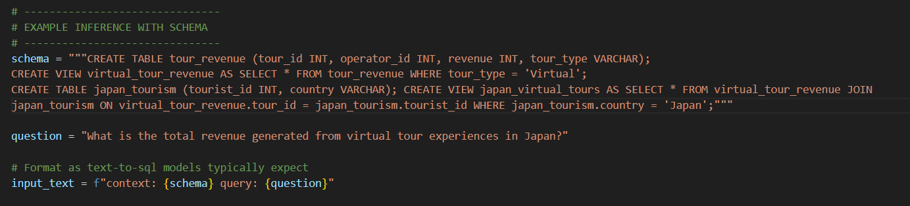
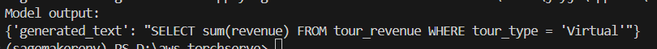

# Text-to-SQL Model Deployment on AWS SageMaker

Complete guide for deploying a HuggingFace text-to-sql model on AWS SageMaker GPU endpoint.

## Prerequisites

- AWS Account with SageMaker access
- Python 3.10+ with conda
- AWS CLI configured

## Step 0: Create IAM Role

### Via AWS Console

1. Go to **IAM Console** → **Roles** → **Create role**
2. Select **AWS service** → **SageMaker**
3. Click **Next**
4. Attach policies:
   - `AmazonSageMakerFullAccess`
   - `AmazonS3FullAccess`
5. Name: `SageMakerExecutionRole`
6. Click **Create role**
7. Copy the Role ARN (format: `arn:aws:iam::ACCOUNT-ID:role/SageMakerExecutionRole`)

### Via AWS CLI
```bash
# Create the role
aws iam create-role \
  --role-name SageMakerExecutionRole \
  --assume-role-policy-document '{
    "Version": "2012-10-17",
    "Statement": [{
      "Effect": "Allow",
      "Principal": {"Service": "sagemaker.amazonaws.com"},
      "Action": "sts:AssumeRole"
    }]
  }'

# Attach SageMaker policy
aws iam attach-role-policy \
  --role-name SageMakerExecutionRole \
  --policy-arn arn:aws:iam::aws:policy/AmazonSageMakerFullAccess

# Attach S3 policy
aws iam attach-role-policy \
  --role-name SageMakerExecutionRole \
  --policy-arn arn:aws:iam::aws:policy/AmazonS3FullAccess

# Get the role ARN
aws iam get-role --role-name SageMakerExecutionRole --query 'Role.Arn' --output text
```

**Save the ARN - you'll need it in Step 5!**

## Project Structure
```
my_model/
├── chat_template.jinja
├── config.json
├── generation_config.json
├── model.safetensors
├── special_tokens_map.json
├── tokenizer_config.json
├── tokenizer.json
├── endpoint.py              # Deployment script
├── inf.py                   # Inference script
├── inference.py             # Custom inference handler
└── model.tar.gz             # Packaged model (generated)
```

## Step 1: Setup Environment
```bash
# Create conda environment
conda create -n sagemakerenv python=3.10 -y
conda activate sagemakerenv

# Install dependencies
pip install "sagemaker<3.0.0" "transformers==4.26.1" "datasets[s3]==2.10.1" --upgrade
```

## Step 2: Package Model

Create `model.tar.gz` with all required files:
```bash
# Navigate to model directory
cd my_model

# Create tar.gz (files at root level)
tar -czf model.tar.gz \
    chat_template.jinja \
    config.json \
    generation_config.json \
    model.safetensors \
    special_tokens_map.json \
    tokenizer_config.json \
    tokenizer.json

# Verify contents
tar -tzf model.tar.gz
```

## Step 3: Upload to S3
```bash
# Create S3 bucket (if needed)
aws s3 mb s3://text-2-sql-buckt

# Upload model
aws s3 cp model.tar.gz s3://text-2-sql-buckt/my_model/model.tar.gz

# Verify upload
aws s3 ls s3://text-2-sql-buckt/my_model/
```

## Step 4: Create Custom Inference Handler

**File: `inference.py`**
```python
# inference.py (NEW FILE - create this)
from transformers import AutoTokenizer, AutoModelForSeq2SeqLM
import torch

def model_fn(model_dir):
    """Load model and tokenizer"""
    tokenizer = AutoTokenizer.from_pretrained(model_dir)
    model = AutoModelForSeq2SeqLM.from_pretrained(
        model_dir,
        device_map="auto",
        torch_dtype=torch.float16
    )
    return {"model": model, "tokenizer": tokenizer}

def predict_fn(data, model_dict):
    """Run inference"""
    model = model_dict["model"]
    tokenizer = model_dict["tokenizer"]
    
    inputs = tokenizer(
        data["inputs"], 
        return_tensors="pt", 
        padding=True,
        truncation=True,
        max_length=512
    ).to(model.device)
    
    outputs = model.generate(
        **inputs, 
        max_length=512,
        num_beams=1,
        early_stopping=True
    )
    
    result = tokenizer.batch_decode(outputs, skip_special_tokens=True)
    
    return {"generated_text": result[0]}
```

## Step 5: Deploy Endpoint

**File: `endpoint.py`**
```python
# ep.py
import sagemaker
from sagemaker.huggingface import HuggingFaceModel

# -------------------------------
# CONFIGURATION
# -------------------------------
sess = sagemaker.Session()
role = "arn:aws:iam::862763500155:role/SageMakerExecutionRole"
model_data = "s3://text-2-sql-buckt/my_model/model.tar.gz"              # Fixed: must be .tar.gz

# -------------------------------
# CREATE HUGGING FACE MODEL
# -------------------------------
huggingface_model = HuggingFaceModel(
    model_data=model_data,
    role=role,
    transformers_version="4.51",                                        # Can use shorthand
    pytorch_version="2.6",
    py_version="py312",
    entry_point="inference.py"  # Enabled for text2sql
)

# -------------------------------
# DEPLOY ENDPOINT ON GPU
# -------------------------------
predictor = huggingface_model.deploy(
    initial_instance_count=1,
    instance_type="ml.g5.xlarge",
    endpoint_name="text2sql-endpoint-2"
)

print("Endpoint deployed successfully!")
print("Endpoint name:", predictor.endpoint_name)
```

**Deploy:**
```bash
python endpoint.py
```

*Note: Deployment takes 5-10 minutes.*

## Step 6: Run Inference

**File: `inf.py`**
```python
# if.py
import sagemaker
from sagemaker.huggingface import HuggingFacePredictor

# -------------------------------
# CONFIGURATION
# -------------------------------
sess = sagemaker.Session()
endpoint_name = "text2sql-endpoint-2"

# -------------------------------
# CONNECT TO ENDPOINT
# -------------------------------
predictor = HuggingFacePredictor(endpoint_name=endpoint_name, sagemaker_session=sess)

# -------------------------------
# EXAMPLE INFERENCE WITH SCHEMA
# -------------------------------
schema = """
CREATE TABLE customers (
    customer_id INT PRIMARY KEY,
    first_name VARCHAR(50),
    last_name VARCHAR(50),
    email VARCHAR(100),
    city VARCHAR(50),
    state VARCHAR(2),
    created_at TIMESTAMP
);
"""

question = "Show all customers from New York."

# Format as text-to-sql models typically expect
input_text = f"Generate SQL for \n\ncontext: {schema}\n\n\query: {question}\nSQL:"

response = predictor.predict({"inputs": input_text})

print("Model output:")
print(response)
```

**Run inference:**
```bash
python inf.py
```

## Step 7: Monitor and Manage

**Check endpoint status:**
```bash
aws sagemaker describe-endpoint --endpoint-name text2sql-endpoint
```

**Delete endpoint (to save costs):**
```bash
aws sagemaker delete-endpoint --endpoint-name text2sql-endpoint
```

## Output





## Costs

**ml.g5.xlarge pricing:**
- ~$1.01/hour
- NVIDIA A10G GPU (24GB)
- 4 vCPUs, 16GB RAM

**Remember to delete endpoint when not in use!**

## Troubleshooting

### IAM Role Issues
- Ensure role has both `AmazonSageMakerFullAccess` and `AmazonS3FullAccess` policies
- Verify trust relationship allows `sagemaker.amazonaws.com` to assume the role
- Check your account ID in the role ARN matches your AWS account

### Model Error 400
- Check CloudWatch logs: AWS Console → CloudWatch → Log Groups → `/aws/sagemaker/Endpoints/text2sql-endpoint`
- Verify `inference.py` is included in deployment
- Ensure model files are complete in `model.tar.gz`

### Unsupported Version Error
- Use supported versions: transformers 4.51, pytorch 2.3, py310
- Update `endpoint.py` with correct versions

### S3 Access Error
- Verify IAM role has `AmazonS3FullAccess` permission
- Check bucket name and path are correct
- Ensure `model.tar.gz` exists at the specified S3 path

## References

- [SageMaker Python SDK](https://sagemaker.readthedocs.io/)
- [HuggingFace on SageMaker](https://huggingface.co/docs/sagemaker/inference)
- [SageMaker Pricing](https://aws.amazon.com/sagemaker/pricing/)
- [AWS IAM Roles](https://docs.aws.amazon.com/IAM/latest/UserGuide/id_roles.html)
